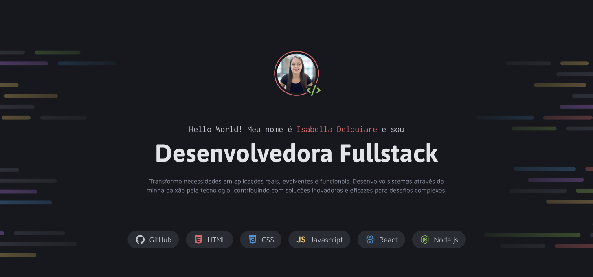

<h1 align="center">💼 Portfólio Dev</h1>

  Projeto de portfólio criado para praticar layouts com CSS e técnicas modernas de front-end. Este é meu quinto projeto :)

  <a href="#-tecnologias">Tecnologias</a>&nbsp;&nbsp;&nbsp;|&nbsp;&nbsp;&nbsp;
  <a href="#-projeto">Projeto</a>&nbsp;&nbsp;&nbsp;|&nbsp;&nbsp;&nbsp;
  <a href="#-aprendizados">Aprendizados</a>&nbsp;&nbsp;&nbsp;|&nbsp;&nbsp;&nbsp;
  <a href="#memo-licença">Licença</a>

 

  

## 🚀 Tecnologias

Esse projeto foi desenvolvido com:

- HTML5
- CSS3
- Git e GitHub
- Figma

## 💻 Projeto

Este é um portfólio desenvolvido como parte do meu aprendizado em front-end. Ele apresenta meus primeiros projetos, com foco em organização visual e técnicas modernas de layout com CSS.

## 📚 Aprendizados

Nesse projeto, eu pratiquei:

- Criação de layouts com CSS
- CSS Flexbox para distribuição e alinhamento de elementos
- Posicionamento de seções e elementos com `position`, `margin` e `gap`
- CSS Grid para organizar seções em colunas
- Variáveis CSS para padronização de cores e fontes
- Uso de pseudo-classes (`:hover`, `:focus`) e pseudo-elementos (`::before`, `::after`) para interatividade

  
👉 **Você pode acessar o projeto online aqui:**  
[https://delquiare.github.io/Portfolio-dev/](https://delquiare.github.io/Portfolio-Dev/)

## :memo: Licença
Esse projeto está sob a licença MIT.  

